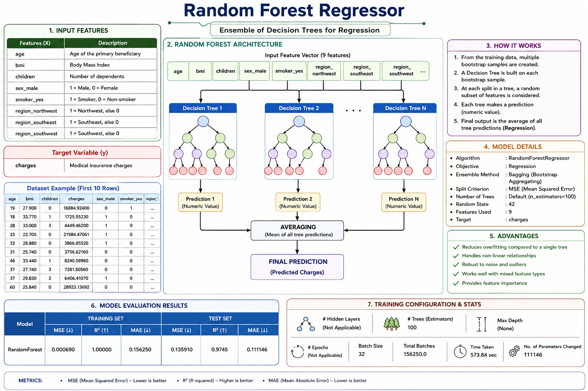
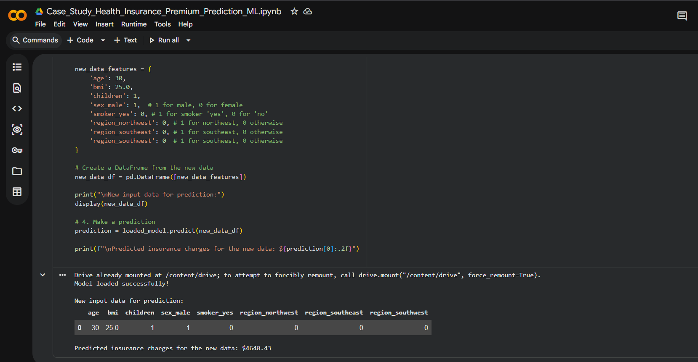

# 🏥 Health Insurance Premium Prediction

A Machine Learning project that predicts **health insurance charges/premium** based on a customer's demographic and health-related information.

The project covers the complete Machine Learning workflow:

**Data Analysis → EDA → Data Preprocessing → Model Building → Model Evaluation → Prediction → Model Saving**

---

## 📌 Project Overview

Health insurance companies need to estimate the premium associated with different customers.

This project uses Machine Learning to predict insurance charges using:

* Age
* Sex
* BMI
* Number of Children
* Smoking Status
* Region

The target variable is **`charges`**, which is a continuous numerical value. Therefore, this is a **Supervised Learning → Regression** problem.

---

## 🎯 Objectives

* Predict health insurance charges for a customer.
* Analyze factors that influence insurance costs.
* Perform Exploratory Data Analysis (EDA).
* Convert categorical variables into numerical features.
* Train and compare multiple regression models.
* Evaluate model performance using MSE, R² and MAE.
* Predict insurance charges for unseen customer data.
* Save the trained model using `joblib`.

---

## 📊 Dataset

The dataset contains **1,338 records and 7 columns** before duplicate removal.

| Feature    | Description                | Type        |
| ---------- | -------------------------- | ----------- |
| `age`      | Customer age               | Numerical   |
| `sex`      | Male / Female              | Categorical |
| `bmi`      | Body Mass Index            | Numerical   |
| `children` | Number of dependents       | Numerical   |
| `smoker`   | Smoking status             | Categorical |
| `region`   | Residential region         | Categorical |
| `charges`  | Insurance charge / premium | Target      |

The dataset contains **1 duplicate record**, which was removed before modeling, leaving **1,337 records**.

---

## 🔄 Machine Learning Workflow

```text
Dataset
   ↓
Data Understanding
   ↓
Data Cleaning
   ↓
Exploratory Data Analysis
   ↓
Categorical Encoding
   ↓
Train/Test Split
   ↓
Model Training
   ↓
Model Evaluation
   ↓
Model Comparison
   ↓
Prediction on New Data
   ↓
Save Model using Joblib
```

---

## 🔍 Exploratory Data Analysis

The project analyzes:

* Age distribution
* Gender distribution
* BMI distribution
* Smoker distribution
* Regional distribution
* Insurance charge distribution
* Age vs Charges
* BMI vs Charges
* Smoker vs Charges
* Gender vs Charges
* Children vs Charges
* Region vs Charges
* Correlation between numerical features

### Key Findings

* Insurance charges generally increase with **age**.
* **Smoking status** has a strong relationship with insurance charges.
* Higher BMI is associated with higher charges.
* Insurance charges vary significantly between smokers and non-smokers.
* The dataset contains high-value charge outliers.
* Region has comparatively less influence than some other features.

---

## 🧹 Data Preprocessing

Categorical variables were converted into numerical features using **dummy / one-hot encoding**.

The following columns were encoded:

```text
sex
smoker
region
```

With `drop_first=True`, the final model features became:

```text
age
bmi
children
sex_male
smoker_yes
region_northwest
region_southeast
region_southwest
```

The dataset was then divided into:

* **70% Training Data**
* **30% Testing Data**

Result:

```text
Training samples : 935
Testing samples  : 402
Features         : 8
```

---

## 🤖 Models Tested

Three main regression approaches were evaluated.

### 1. Linear Regression

A multiple Linear Regression model was trained using all available features.

### 2. Random Forest Regression

A `RandomForestRegressor` was trained to capture more complex relationships between the features and insurance charges.

### 3. Polynomial Regression

Polynomial Regression with **degree 2** was tested to capture non-linear relationships.

The project also initially experimented with simpler Linear Regression models using:

* Age only
* Age + BMI

---

## 📈 Model Performance

| Model                            |    Test R² | Test MAE |    Test MSE |
| -------------------------------- | ---------: | -------: | ----------: |
| Linear Regression                | **0.7724** |  4181.82 | 3.894 × 10⁷ |
| Random Forest                    | **0.8636** |  2633.18 | 2.334 × 10⁷ |
| Polynomial Regression (Degree 2) | **0.8508** |  2940.82 | 2.553 × 10⁷ |

Based on the experiments, **Random Forest Regression achieved the highest test R² (0.8636)** among the tested models.

However, the model used for the final saved prediction workflow is the **Linear Regression model**, which was saved using `joblib`.

---

## 🧠 Important Linear Regression Features

The trained Linear Regression equation was:

```text
Charges =
-11516.78
+ 251.25 × age
+ 328.38 × bmi
+ 522.16 × children
- 111.91 × sex_male
+ 22874.45 × smoker_yes
- 465.75 × region_northwest
- 936.10 × region_southeast
- 765.58 × region_southwest
```

One important observation is the large coefficient associated with:

```text
smoker_yes = 22874.45
```

This indicates that smoking status has a substantial influence on the predicted insurance charges in this model.

---

## 🔮 Prediction on New Data

The trained model can predict insurance charges for a completely new customer.

### Example Input

```text
Age       : 54
Sex       : Female
BMI       : 31.9
Children  : 3
Smoker    : No
Region    : Southwest
```

After encoding:

```text
age                  = 54
bmi                  = 31.9
children             = 3
sex_male             = 0
smoker_yes           = 0
region_northwest     = 0
region_southeast     = 0
region_southwest     = 1
```

### Prediction

```text
Predicted Charges: 13326.82
```

This prediction was generated using the saved Linear Regression model.

---

## 💾 Model Saving

The trained Linear Regression model was saved using:

```python
import joblib

joblib.dump(
    model_lr,
    "linear_regression_model.joblib"
)
```

`joblib` is appropriate for saving scikit-learn models such as `LinearRegression` and `RandomForestRegressor`.

The saved model can later be loaded without retraining:

```python
import joblib

loaded_model = joblib.load(
    "linear_regression_model.joblib"
)
```

The input data must have the same feature names, order, and encoding used during training.

---

## 🛠️ Technologies Used

| Technology   | Purpose                   |
| ------------ | ------------------------- |
| Python       | Programming language      |
| Pandas       | Data manipulation         |
| NumPy        | Numerical operations      |
| Matplotlib   | Data visualization        |
| Seaborn      | Statistical visualization |
| Scikit-learn | Machine Learning          |
| Joblib       | Model serialization       |
| Google Colab | Development environment   |
| Google Drive | Dataset/model storage     |
| Git & GitHub | Version control           |

---

## 📁 Project Structure

```text
Health_Insurance_Prediction_ML/
│
├── .git/
├── .gitignore
│
├── insurance_prediction.csv
│
├── Health_Insurance_Prediction.ipynb
│
├── Predict_model_health_insurance_prediction.ipynb
│
├── git_config.ipynb
│
├── Case_Study_Health_Insurance_Premium_Prediction_ML.ipynb
│
├── 0786fe86-e622-45a6-a278-19a24f1d47f6.png
│
└── README.md
```

> **Note:** The exact filename of the model-creation notebook should match the filename in the repository.

---

## 📂 Project Files

| File                                                                                                   | Purpose                                                                                                      |
| ------------------------------------------------------------------------------------------------------ | ------------------------------------------------------------------------------------------------------------ |
| [`insurance_prediction.csv`](./insurance_prediction.csv)                                               | Dataset used for training and analysis                                                                       |
| [`Health_Insurance_Prediction.ipynb`](./Health_Insurance_Prediction.ipynb)                             | **Model creation notebook** — data analysis, EDA, preprocessing, model training, evaluation and model saving |
| [`Predict_model_health_insurance_prediction.ipynb`](./Predict_model_health_insurance_prediction.ipynb) | **Prediction notebook** — loads the saved model and predicts insurance charges for new customer data         |
| [`git_config.ipynb`](./git_config.ipynb)                                                               | Git/GitHub configuration and repository setup                                                                |
| `.gitignore`                                                                                           | Specifies files and folders excluded from Git                                                                |
| `Case_Study_Health_Insurance_Premium_Prediction_ML.ipynb`                                                   | Project case study/documentation                                                                             |
| `0786fe86-e622-45a6-a278-19a24f1d47f6.png`                                                             | Project screenshot/image                                                                                     |
| `README.md`                                                                                            | Project documentation                                                                                        |

---

## 🧪 Notebook Workflow

The project is divided into **two main notebooks**.

### 1. Model Creation & Training

**`Health_Insurance_Prediction.ipynb`**

This notebook contains the complete model development process:

```text
Load Dataset
     ↓
Understand Dataset
     ↓
Data Cleaning
     ↓
Exploratory Data Analysis
     ↓
Feature Analysis
     ↓
Categorical Encoding
     ↓
Train/Test Split
     ↓
Train Regression Models
     ↓
Evaluate Models
     ↓
Compare Models
     ↓
Select Model
     ↓
Save Trained Model
```

The notebook experiments with:

* Linear Regression
* Random Forest Regression
* Polynomial Regression

The models are evaluated using:

* MSE
* R² Score
* MAE

The trained Linear Regression model is saved as:

```text
linear_regression_model.joblib
```

---

### 2. Prediction

**`Predict_model_health_insurance_prediction.ipynb`**

This notebook is used after the model has already been trained.

```text
Mount Google Drive
       ↓
Load Saved .joblib Model
       ↓
Get New Customer Input
       ↓
Apply Same Feature Encoding
       ↓
Create Input DataFrame
       ↓
Pass Data to Model
       ↓
Predict Insurance Charges
```

Example input:

```text
Age       : 54
Sex       : Female
BMI       : 31.9
Children  : 3
Smoker    : No
Region    : Southwest
```

Example output:

```text
Predicted Insurance Charges: 13326.82
```

The prediction notebook uses the same feature order and encoding as the training data, which is essential when loading and using the saved model.
---

## 🖼️ Project Screenshots

### Dataset / Project View

<!-- Add screenshot here -->



### Model Prediction

<!-- Add your prediction screenshot here -->

<!--  -->

---

## ▶️ How to Run

### 1. Clone the Repository

```bash
git clone <YOUR_GITHUB_REPOSITORY_URL>
cd Health_Insurance_Prediction_ML
```

### 2. Install Dependencies

```bash
pip install pandas numpy matplotlib seaborn scikit-learn joblib
```

### 3. Open the Notebook

Open:

```text
Predict_model_health_insurance_prediction.ipynb
```

You can run it using:

* Google Colab
* Jupyter Notebook
* VS Code

### 4. Load the Dataset

```python
import pandas as pd

data = pd.read_csv("insurance_prediction.csv")
```

### 5. Train the Model

Run the notebook cells in sequence to:

```text
Load Data
→ Clean Data
→ Perform EDA
→ Encode Features
→ Split Dataset
→ Train Models
→ Evaluate Models
→ Make Predictions
```

---

## 📌 Example Prediction

```text
Input:

Age       = 30
BMI       = 25.0
Children  = 1
Sex       = Male
Smoker    = No
Region    = Northeast

Output:

Predicted Insurance Charges = $4640.43
```

The notebook demonstrates loading the saved model and predicting on new encoded input data.

---

## 💼 Business Insights

The analysis suggests several possible business applications:

* Data-driven premium estimation
* Risk-based pricing
* Customer segmentation
* Smoking-related wellness incentives
* BMI-focused wellness programs
* Personalized insurance plans
* Automated premium calculation

These recommendations are based on the patterns explored in the project.

---

## 🚀 Future Improvements

Possible improvements for the project:

* Create a web interface using Flask or Streamlit.
* Deploy the prediction model as an API.
* Add interactive customer input forms.
* Use a complete preprocessing pipeline.
* Save the best-performing model automatically.
* Add model explainability using feature importance/SHAP.
* Compare additional regression algorithms.
* Deploy the application to a cloud platform.

---

## ⚠️ Disclaimer

This project is created for **educational and Machine Learning demonstration purposes**.

The predicted insurance charge should not be considered an actual insurance quotation or professional financial/insurance advice.

---

## 👨‍💻 Author

**Prakash**

B.E. Computer Science and Engineering

---

## ⭐ Project Highlights

```text
✔ Supervised Machine Learning
✔ Regression Problem
✔ Exploratory Data Analysis
✔ Data Cleaning
✔ Categorical Encoding
✔ Train/Test Split
✔ Multiple Regression Models
✔ Model Evaluation
✔ New Customer Prediction
✔ Joblib Model Saving
✔ Git & GitHub Version Control
```

---
